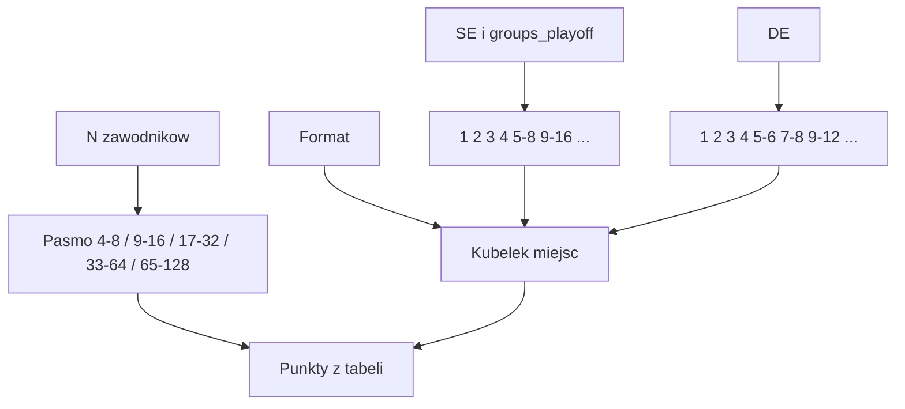

# Design: schematy punktacji sezonowej

**Status:** wdrożone w kodzie (wrzesień 2026)  
**Źródło prawdy produktu:** [`product.md`](product.md) (sekcja „Organizacja i punktacja”)  
**Powiązane:** [`design_tournament_formats_se_de.md`](design_tournament_formats_se_de.md)

Tabele w tym pliku są **źródłem prawdy liczb**. Kod: `SeasonPointTable` + `PointSchemeSeeder`.

---

## 1. Cel

Przyznawać punkty sezonu za miejsce w turnieju tak, żeby:

- większa stawka dawała więcej punktów (więcej osób do wyprzedzenia),
- SE i DE miały **tę samą skalę** (1. miejsce przy tym samym N = tyle samo pkt),
- DE miało **ciaśniejsze kubełki miejsc** (5–6 vs 7–8, nie 5–8),
- `groups_playoff` nie farmił punktów długością fazy grupowej.

---

## 2. Oś skali: N, nie liczba meczów do tytułu

Punkty zależą od **liczby zawodników, którzy weszli do turnieju (N)** — zaakceptowani + goście przy starcie.

Nie zależą od liczby meczów, które mistrz musi rozegrać. W `groups_playoff` admin ustawia grupy i rozmiar playoffu. Przy N = 32 mistrz może mieć np. 5 meczów (czyste SE), 7 (8 grup × 4, awans 16) albo 10 (4 grupy × 8, awans 8). Skala od ścieżki mistrza pozwalałaby sterować tabelą sezonu formatem.

Ranking mierzy **ile osób się wyprzedziło**, nie ile spotkań wpisano. W grupie wolno przegrać i awansować — „mecze do tytułu” zawyżałyby trudność względem SE.

Ta sama zasada co przy SE vs DE: format zmienia **jak liczymy miejsce**, nie **ile 1. miejsce jest warte**.

---

## 3. Progi (pasma N)

Kolejna runda do tytułu w czystym SE/DE pojawia się przy `nextPowerOfTwo(N)`:

| Pasmo | SE/DE: rundy do tytułu (pełna drabinka) | Zwycięzca |
| ----- | ---------------------------------------- | --------- |
| 4–8 | 2–3 (SF+F albo QF+SF+F) | 13 |
| 9–16 | 4 | 20 |
| 17–32 | 5 | 26 |
| 33–64 | 6 | 39 |
| 65–128 | 7 | 52 |

4 scalamy z 5–8 (jak historyczny seeder). Max drabinki i stawki w produkcie: **128**.

**Przyszłość:** gdy limit stawki wzrośnie, dodać pasmo **129–256** (kolejne podwojenie). Na razie N > 128 nie ma schematu.

To odwzorowuje intuicję „więcej meczów = więcej pkt” tam, gdzie jest prawdziwa (SE/DE), bez rozjeżdżania grup. WDF skaluje kategorią i stawką / pełną rundą bez bye — nie formatem. Liniowe co 8 osób jest drobniejsze niż głębokość drabinki i nic nie wnosi przy `groups_playoff`.

Zwycięzca 4–8 … 33–64 = górna krawędź obecnego seedera; 65–128 dociągnięte tym samym krokiem.

---

## 4. Kubełki miejsc

**1–4** — zawsze te same punkty w SE i DE.

**SE** i playoff po grupach (`groups_playoff`):

- 1 / 2 z finału,
- 3 / 4 z meczu o 3. miejsce,
- dalej remis rundy: 5–8, 9–16, 17–32, 33–64, 65–128.

W kodzie miejsce overall jest zapisane jako **początek zakresu** (QF → 5, 1/8 → 9, …) — `TournamentOverallPlaceCalculator`.

**DE** (bez meczu o 3.; `DoubleEliminationPlacement`):

| Miejsce | Kto |
| ------- | --- |
| 1 | zwycięzca Grand Final |
| 2 | przegrany Grand Final |
| 3 | przegrany LB Final |
| 4 | przegrany półfinału LB |
| 5–6, 7–8, 9–12, 13–16, … | wcześniejsze rundy LB (ex aequo) |

W kodzie: 5, 7, 9, 13, 17, 25, … = początek zakresu.

**Split DE vs SE:** dolna połowa kubełka DE = wartość SE dla tej samej głębokości; górna połowa = kilka punktów w stronę lepszego miejsca (granularność, nie premia za format).

**Odpadnięcie w grupie:** punkty z **miejsca overall** w kolumnie SE. Nie skalujemy od `group_size` ani od liczby meczów grupowych.

Przykład: 32 osób, awans 16 → wszyscy 3. w grupie dzielą ~17. miejsce → kubełek 17–32. Czwartych w grupie ~25. miejsce — ten sam kubełek SE, jeśli oba miejsca mieszczą się w 17–32.

---

## 5. Tabele

Puste komórki DE = to miejsce w paśmie nie występuje (za mała drabinka). Lookup: pasmo z N + wiersz, którego zakres zawiera miejsce overall + kolumna formatu.

### 4–8 graczy

| Miejsce | SE / grupy+playoff | DE |
| ------- | ------------------ | -- |
| 1 | 13 | 13 |
| 2 | 10 | 10 |
| 3 | 8 | 8 |
| 4 | 6 | 6 |
| 5–8 / 5–6 | 5 | 5 |
| 7–8 | — | 3 |

### 9–16 graczy

| Miejsce | SE / grupy+playoff | DE |
| ------- | ------------------ | -- |
| 1 | 20 | 20 |
| 2 | 16 | 16 |
| 3 | 13 | 13 |
| 4 | 10 | 10 |
| 5–8 / 5–6 | 7 | 8 |
| 7–8 | — | 7 |
| 9–16 / 9–12 | 5 | 6 |
| 13–16 | — | 4 |

### 17–32 graczy

| Miejsce | SE / grupy+playoff | DE |
| ------- | ------------------ | -- |
| 1 | 26 | 26 |
| 2 | 22 | 22 |
| 3 | 18 | 18 |
| 4 | 14 | 14 |
| 5–8 / 5–6 | 10 | 12 |
| 7–8 | — | 10 |
| 9–16 / 9–12 | 7 | 8 |
| 13–16 | — | 7 |
| 17–32 / 17–24 | 4 | 5 |
| 25–32 | — | 3 |

### 33–64 graczy

| Miejsce | SE / grupy+playoff | DE |
| ------- | ------------------ | -- |
| 1 | 39 | 39 |
| 2 | 33 | 33 |
| 3 | 28 | 28 |
| 4 | 23 | 23 |
| 5–8 / 5–6 | 18 | 20 |
| 7–8 | — | 18 |
| 9–16 / 9–12 | 13 | 15 |
| 13–16 | — | 13 |
| 17–32 / 17–24 | 8 | 10 |
| 25–32 | — | 8 |
| 33–64 / 33–48 | 4 | 5 |
| 49–64 | — | 3 |

### 65–128 graczy

| Miejsce | SE / grupy+playoff | DE |
| ------- | ------------------ | -- |
| 1 | 52 | 52 |
| 2 | 45 | 45 |
| 3 | 38 | 38 |
| 4 | 32 | 32 |
| 5–8 / 5–6 | 24 | 28 |
| 7–8 | — | 24 |
| 9–16 / 9–12 | 17 | 20 |
| 13–16 | — | 17 |
| 17–32 / 17–24 | 11 | 14 |
| 25–32 | — | 11 |
| 33–64 / 33–48 | 6 | 8 |
| 49–64 | — | 6 |
| 65–128 / 65–96 | 3 | 4 |
| 97–128 | — | 2 |

---

## 6. Przykłady

### SE, 8 graczy (pasmo 4–8)

Drabinka 8, mecz o 3. miejsce.

| Zawodnik | Miejsce overall | Punkty |
| -------- | --------------- | ------ |
| Zwycięzca finału | 1 | 13 |
| Przegrany finału | 2 | 10 |
| Wygrał mecz o 3. | 3 | 8 |
| Przegrał mecz o 3. | 4 | 6 |
| Czterech z ćwierćfinału | 5 (ex aequo 5–8) | 5 |

### DE, 8 graczy (pasmo 4–8)

Bez meczu o 3.; miejsca z drugiej porażki.

| Zawodnik | Miejsce overall | Punkty |
| -------- | --------------- | ------ |
| Zwycięzca GF | 1 | 13 |
| Przegrany GF | 2 | 10 |
| Przegrany LB Final | 3 | 8 |
| Przegrany półfinału LB | 4 | 6 |
| Dwóch z wcześniejszej rundy LB | 5 (5–6) | 5 |
| Dwóch z najwcześniejszej rundy LB | 7 (7–8) | 3 |

1.–4. jak w SE. 5.–8. rozdzielone: DE 7–8 = 3, nie 5.

### Grupy + playoff, 32 graczy, awans 16 (pasmo 17–32)

Osiem grup po 4, top 2 → drabinka 16 (SE). Kolumna SE.

| Kto | Miejsce overall | Punkty |
| --- | --------------- | ------ |
| Mistrz | 1 | 26 |
| 2. | 2 | 22 |
| 3. / 4. (mecz o 3.) | 3 / 4 | 18 / 14 |
| Ćwierćfinał playoffu | 5 (5–8) | 10 |
| 1/8 playoffu | 9 (9–16) | 7 |
| 3. w grupie (nie awansowali; 8 osób) | 17 (ex aequo) | 4 |
| 4. w grupie (8 osób) | 25 (ex aequo) | 4 |

17. i 25. wpadają w ten sam kubełek SE 17–32. Inny podział grup (np. awans 8) przesuwa overall, nie zmienia tabeli pasma.

---

## 7. Stan kodu

Lookup: **pasmo N + miejsce overall + format** (`se` dla SE i `groups_playoff`, `de` dla DE).

- `SeasonPointTable` — stałe liczb
- `PointSchemeSeeder` — 5 pasm 4–128
- `PointSchemeDomain::pointsForPlace`
- `TournamentOverallPlaceService` — najpierw miejsce overall, potem punkty

`elimination_stage` na `tournament_results` zostaje do UI (w tym DE `resultStageForRound`) i **nie** steruje punktami.

Pasmo 129–256: poza zakresem do podniesienia limitu stawki.
