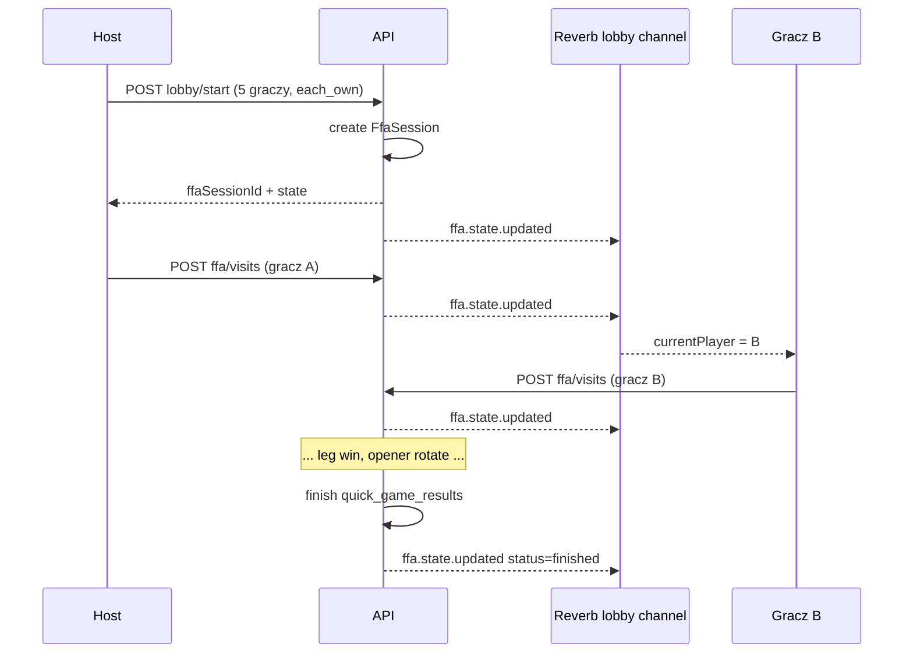

# Design: Quick game FFA sync

**Status:** zaimplementowane (unified FFA N=2..8)  
**Źródło prawdy produktu:** [`product.md`](product.md)

---

## 1. Cel

Jeden silnik **FFA N=2..8** dla quick game (oba tryby urządzeń). Po starcie lobby tworzona jest sesja FFA; synchronizacja przez `/api/quick-game/lobby/{id}/ffa/*` i WS `ffa.state.updated`. Po zakończeniu: `quick_games` + `quick_game_results`.

**Legacy:** stare H2H `/quick-games/{id}/scoring/*` — tylko turniej / kompatybilność wsteczna, nie quick game z lobby.

---

## 2. Decyzje architektoniczne

### 2.1 Unified FFA (bez osobnej ścieżki 2P)

2 graczy to ten sam moduł co 8 — `QuickGameFfaScoringService`, te same endpointy i mobile hook `useQuickGameFfaScoring`.

### 2.2 Routing po starcie lobby

| Gracze | `scoring_mode` | Backend po `startGame` |
|--------|----------------|-------------------------|
| **2** | `each_own` / `one_device` | `quick_games` + istniejący `/quick-games/{id}/scoring/*` (bez zmian) |
| **3–8** | `one_device` **lub** `each_own` | **`QuickGameFfaSession`** + `/quick-game/lobby/{id}/ffa/*` |

Mobile: `GameScoringScreen` wybiera **H2H hook** vs **FFA hook** na podstawie payloadu startu (`quickGameId` vs `ffaSessionId`).

### 2.3 Kanał WebSocket — lobby, nie nowy kanał

Kanał **`private-quick-game-lobby.{lobbyId}`** już istnieje, autoryzacja uczestników jest gotowa (`routes/channels.php`).

Nowy event (obok `lobby.updated`):

- **`ffa.state.updated`** — pełny stan meczu FFA (jak `GameScoringStateUpdated` dla H2H).

Backup poll: GET stanu co ~2,5 s (jak `useGameScoring`).

### 2.4 Persystencja — relacyjna (nie sam JSON)

W przeszłości istniała `quick_game_sessions` z kolumną `state` JSON; tabela została **usunięta** (`2026_05_17_130000_move_match_meta_from_sessions_to_lobbies.php`). W 4C2 wprowadzamy **nowy model relacyjny** (wizyty z `client_visit_id`, `is_voided`), analogiczny do `game_visits` / `game_legs`:

- audyt i undo,
- idempotencja POST,
- mniejsze ryzyko rozjazdu stanu między urządzeniami.

### 2.5 `one_device` i `each_own` na **tym samym** API FFA

Jeden kontrakt; różni się **tylko walidacja kto może wysłać wizytę**:

- `one_device` → tylko **host** lobby.
- `each_own` → tylko gracz, którego `playerId` == `currentPlayerId` w stanie.

---

## 3. Model danych (propozycja migracji)

### 3.1 `quick_game_ffa_sessions`

| Kolumna | Typ | Opis |
|---------|-----|------|
| `id` | bigint PK | |
| `lobby_id` | FK → `quick_game_lobbies` | 1 aktywna sesja na lobby |
| `legs_to_win` | tinyint | BO3 = 2 |
| `game_type` | string | `501` (MVP) |
| `scoring_mode` | string | `one_device` \| `each_own` |
| `starting_score` | smallint | 501 |
| `status` | string | `in_progress` \| `finished` |
| `player_order` | json | `[player_id, …]` — kolejność z lobby |
| `leg_opener_index` | tinyint | indeks w `player_order` — kto zaczął **bieżący** leg |
| `current_player_index` | tinyint | czyja teraz kolej |
| `current_leg_number` | tinyint | ≥ 1 |
| `state_version` | unsigned int | inkrement przy każdej mutacji (opcjonalnie optimistic lock) |
| `quick_game_id` | FK nullable | wypełniane po `finish` — link do rekordu wyniku |
| `started_at`, `finished_at` | timestamp | |

Indeks unikalny: `(lobby_id)` where status = in_progress (lub jedna sesja na lobby ever — do ustalenia przy implementacji).

### 3.2 `quick_game_ffa_visits`

Wzorowane na `game_visits`:

| Kolumna | Typ |
|---------|-----|
| `id` | bigint PK |
| `ffa_session_id` | FK |
| `leg_number` | tinyint |
| `player_id` | FK → players |
| `visit_number` | int (per leg) |
| `score`, `remaining_before`, `remaining_after` | smallint |
| `darts_in_visit` | tinyint |
| `closed_leg` | bool |
| `bust` | bool |
| `is_voided` | bool |
| `client_visit_id` | uuid unique |

Legi zamknięte = ostatnia wizyta w legu ma `closed_leg=true` + `winner` wyliczany z tej wizyty.

**Legi wygrane per gracz:** agregacja z wizyt zamykających leg (`closed_leg` + `remaining_after=0`).

### 3.3 Powiązanie z wynikiem

Po `status=finished`:

1. `QuickGameRepository::createWithResults($playerIds, $lobbyId)` — jak dziś w `finishFromMobile`.
2. `saveResults` — N wierszy w `quick_game_results`.
3. `ffa_session.quick_game_id` = utworzony rekord.

---

## 4. Stan API (payload GET / broadcast)

```json
{
  "session": {
    "id": 42,
    "lobbyId": 7,
    "status": "in_progress",
    "legsToWin": 2,
    "gameType": "501",
    "scoringMode": "each_own",
    "startingScore": 501,
    "currentLegNumber": 2,
    "legOpenerIndex": 1,
    "currentPlayerIndex": 2,
    "stateVersion": 18
  },
  "players": [
    {
      "playerId": 10,
      "lobbyPlayerId": 101,
      "name": "Anna",
      "orderIndex": 0,
      "legsWon": 1,
      "remaining": 441,
      "legAverage": 85.2,
      "gameAverage": 82.0
    }
  ],
  "currentLeg": {
    "legNumber": 2,
    "open": true,
    "openerPlayerId": 11
  },
  "visits": [
    {
      "id": 9001,
      "playerId": 11,
      "visitNumber": 1,
      "score": 60,
      "remainingBefore": 501,
      "remainingAfter": 441,
      "dartsInVisit": 3,
      "closedLeg": false,
      "bust": false
    }
  ],
  "myPlayerIndex": 2,
  "youAreHost": false
}
```

Pola user-specific (`myPlayerIndex`, `youAreHost`) tylko w odpowiedzi HTTP z auth; broadcast może je pomijać — klient liczy `myPlayerIndex` lokalnie (jak w lobby).

---

## 5. Endpointy REST

Prefix: **`/api/quick-game/lobby/{lobbyId}/ffa`** (auth: sanctum, uczestnik lobby).

| Metoda | Ścieżka | Opis |
|--------|---------|------|
| `GET` | `/state` | Pełny stan (poll / po reconnect) |
| `POST` | `/visits` | Wizyta gracza (idempotencja `clientVisitId`) |
| `POST` | `/visits/undo` | Cofnij ostatnią **ni void** wizytę w otwartym legu |
| `POST` | `/legs/close` | Alternatywa: zamknięcie lega checkout + statystyki lega (jeśli nie przez `closedLeg` w wizycie) |

**Tworzenie sesji:** nie osobny endpoint — **`QuickGameLobbyService::startGame`** gdy `players.count >= 3`:

- tworzy `quick_game_ffa_sessions`,
- **nie** wywołuje `createLiveQuickGameIfEligible`,
- w payloadzie startu: `ffaSessionId`, brak `quickGameId`.

**Leg 1 — bull:** opcjonalny `POST /ffa/start-leg` z `{ "firstPlayerId" }` tylko gdy `currentLegNumber=1` i brak wizyt — ustawia `leg_opener_index` / `current_player_index`. Mobile: modal bull tylko offline dziś → ten sam UX online dla FFA.

### 5.1 POST `/visits` — body

```json
{
  "playerId": 11,
  "score": 60,
  "remainingBefore": 501,
  "remainingAfter": 441,
  "dartsInVisit": 3,
  "closedLeg": false,
  "bust": false,
  "clientVisitId": "550e8400-e29b-41d4-a716-446655440000"
}
```

Walidacja serwera:

1. Sesja `in_progress`, leg otwarty.
2. `playerId` ∈ `player_order`.
3. **Kolejka:** `playerId` == `currentPlayerId` (wyjątek: bust → ten sam gracz ponownie).
4. **Tryb urządzeń:** host-only vs current player (patrz §2.5).
5. `remainingAfter` spójne z regułami 501 double out (MVP: jak H2H — trust + walidacja checkout przy `closedLeg`).
6. Po wizycie: przelicz `current_player_index`; przy `closedLeg`: `legsWon`, rotacja openera **`(legOpenerIndex + 1) % N`**, nowy leg lub `finished`.

### 5.2 Zakończenie meczu

Gdy któryś gracz ma `legsWon >= legsToWin`:

- `session.status = finished`,
- zapis wyniku (§3.3),
- broadcast `ffa.state.updated` + opcjonalnie `lobby.updated` ze statusem lobby,
- event `gameClosed` po stronie mobile.

---

## 6. WebSocket

**Kanał:** `private-quick-game-lobby.{lobbyId}` (istniejący).

**Event:** `ffa.state.updated`  
**Payload:** `{ "state": { … } }` — ten sam kształt co GET `/state`.

**Event class (backend):** `QuickGameFfaStateUpdated` implements `ShouldBroadcastNow`.

Subskrypcja mobile: rozszerzenie `useQuickGameLobbyRealtime` **lub** osobny `useQuickGameFfaRealtime` na tym samym kanale Pusher (preferowane: **osobny hook** czytelniejszy dla `GameScoringScreen`).

---

## 7. Mobile — integracja

### 7.1 Routing w `GameScoringScreen`

```text
isQuickGame && quickGameId        → useGameScoring (H2H, 2P)
isQuickGame && ffaSessionId       → useQuickGameFfaScoring (FFA, 3–8)
isQuickGame && !quickGameId && !ffaSessionId && N >= 3
                                  → offline fallback (4C1 one_device tylko host)
```

Po implementacji 4C2: **nie startuj** FFA 3–8 bez `ffaSessionId` w trybie `each_own` (usuń alert „wkrótce”).

### 7.2 Hook `useQuickGameFfaScoring`

Odpowiednik `useGameScoring`:

| Odpowiedzialność | H2H | FFA |
|------------------|-----|-----|
| Poll stanu | ✓ | ✓ |
| WS | `quick-game.{id}` | `quick-game-lobby.{lobbyId}` |
| `submitVisit` | ✓ | ✓ |
| `undoVisit` | ✓ | ✓ |
| `closeLegWithWinner` | ✓ | ✓ (checkout w wizycie) |
| Mapowanie na reducery | `applyGameScoringState` | **`applyFfaScoringState`** (nowy helper) |
| Rotacja openera | quick only | zawsze z serwera |

`inputPolicy`: `{ type: 'ffa', scoringMode, isHost, myPlayerIndexFromLobby }` — jak quick w H2H.

### 7.3 Lobby start payload

Rozszerzyć `QuickGameLobbyPayload` po starcie:

```json
{
  "status": "started",
  "ffaSessionId": 42,
  "quickGameId": null,
  "scoringMode": "each_own",
  "players": [ … ],
  "myPlayerIndex": 2
}
```

Dla 2P bez zmian: `quickGameId`, brak `ffaSessionId`.

### 7.4 Wspólna logika UI

- Ten sam `GameScoringScreen`, `Counter`, rotacja openera **z serwera** (już §4B w offline — FFA online nie liczy lokalnie).
- `N` do **8** graczy — rozszerzyć reducery (dziś cap 6 w UI).

---

## 8. Backend — warstwy (propozycja plików)

```
app/
  Models/QuickGame/QuickGameFfaSession.php
  Models/QuickGame/QuickGameFfaVisit.php
  Repositories/QuickGame/QuickGameFfaSessionRepository.php
  Repositories/QuickGame/QuickGameFfaVisitRepository.php
  Services/QuickGame/QuickGameFfaScoringService.php   # reguły, mutacje
  Support/QuickGameFfa/QuickGameFfaStateBuilder.php   # GET payload
  Http/Controllers/Api/QuickGameFfaController.php
  Events/QuickGameFfaStateUpdated.php
  DTO/QuickGameFfa/RecordFfaVisitDTO.php
tests/Feature/QuickGameFfaScoringTest.php
```

Zmiany w istniejącym kodzie:

- `QuickGameLobbyService::startGame` — branch FFA vs H2H.
- `routes/api.php` — grupa `ffa`.
- **Bez zmian** w `GameScoringService` / H2H.

---

## 9. Reguły biznesowe (checklist implementacji)

- [ ] Kolejność graczy = `player_order` z lobby (host ustawia przed startem).
- [ ] Rotacja openera: `(opener + 1) % N` po zamknięciu lega (**nie** zwycięzca).
- [ ] BO3: `legsToWin = 2`.
- [ ] Bust: ten sam gracz rzuca ponownie.
- [ ] Checkout: `closedLeg=true`, `remainingAfter=0`.
- [ ] `each_own`: tylko aktualny gracz POST wizyty.
- [ ] `one_device`: tylko host POST wizyty; inni widzą stan przez WS.
- [ ] Undo: tylko ostatnia aktywna wizyta w otwartym legu; przeliczenie `current_player_index`.
- [ ] Idempotencja: ten sam `clientVisitId` → 200 + aktualny stan.
- [ ] Wynik końcowy w `quick_game_results` dla wszystkich N graczy.

---

## 10. Etapy implementacji 4C2 (PR-y)

| PR | Zakres | Szacunek |
|----|--------|----------|
| **4C2a** | Migracje + modele + `FfaStateBuilder` + GET `/state` + start sesji w `startGame` | 1 d |
| **4C2b** | POST `/visits`, undo, reguły kolejki + opener + leg win, testy feature | 1–2 d |
| **4C2c** | Event WS + mobile `useQuickGameFfaScoring` + `applyFfaScoringState` + podpięcie `GameScoringScreen` | 1–2 d |
| **4C2d** | Finalizacja → `quick_game_results`, achievements, testy E2E 3P/5P | 0.5–1 d |

**Regresja obowiązkowa:** 2P `each_own` i `one_device` przez stary H2H — `QuickGameScoringApiTest`, lobby 2P start.

---

## 11. Relacja z 4C1 (po 4C2)

Gdy 4C2 działa:

| Scenariusz | Ścieżka |
|------------|---------|
| 3–8 `each_own` | FFA API + WS |
| 3–8 `one_device` | **Ten sam FFA API** — host wpisuje; opcjonalnie bez WS dla gości (ale WS nadal zalecane do podglądu) |
| 3–8 offline / brak sieci | 4C1: lokalny scoring + jeden POST `finishFromMobile` (fallback) |

4C1 do dokończenia po 4C2:

- cap **8** graczy w `GameScoringScreen`,
- polish UX `one_device` (komunikaty dla nie-hostów),
- ewentualnie start FFA sesji także dla `one_device` 3–8 (wspólne API z 4C2).

---

## 12. Scenariusze testowe (manual + automat)

1. **5P zdalnie `each_own`:** A→B→C→D→E w legu 1; leg 2 opener B; checkout; BO3 zwycięzca.
2. **5P na miejscu `one_device`:** tylko host może POST; pozostali widzą sync.
3. **Undo** w środku lega — poprawna kolejka.
4. **Reconnect** — GET `/state` odtwarza UI.
5. **2P each_own** — bez regresji H2H.

---

## 13. Otwarte pytania (do domknięcia przed kodem 4C2a)

| # | Pytanie | Rekomendacja |
|---|---------|--------------|
| 1 | Bull online dla FFA leg 1 — API czy domyślnie `orderIndex=0`? | MVP: domyślnie gracz 0; opcjonalny POST bull przed pierwszą wizytą (spójność z offline modalem). |
| 2 | Per-dart vs per-visit w FFA? | MVP: **per-visit** (jak domyślny tryb H2H bez dart mode) — prostsze API. |
| 3 | Achievements w FFA | Po `finished` — ten sam POST co dziś (`achievements` w update), bez wizyt w achievement flow. |

---

## 14. Diagram przepływu



---

*Dokument przygotowany pod implementację kroku 4C2. Po akceptacji — start od PR **4C2a**.*
