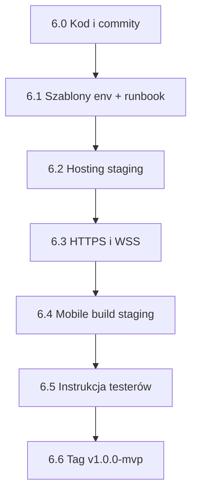

# Krok 6 — Release candidate (MVP v1)

Plan operacyjny domknięcia MVP poza lokalnym LAN.  
Nadrzędny dokument: [`plan_mvp_domkniecie.md`](plan_mvp_domkniecie.md).

Ostatnia aktualizacja: lipiec 2026.

---

## Diagram

---

## 6.0 — Domknięcie kodu przed releasem

**Cel:** repo gotowe do wdrożenia; brak wiszących zmian MVP.

| # | Zadanie | Status |
|---|---------|--------|
| 6.0.1 | Commit: rejestracja + weryfikacja email (backend) | ✅ |
| 6.0.2 | Commit: ekran rejestracji + env API (mobile) | ✅ |
| 6.0.3 | `php artisan test` — zielone (176 passed) | ✅ |
| 6.0.4 | Push obu repo na remote | ⬜ |

**Kryterium done:** `git status` czysty na `main`; testy OK.

---

## 6.1 — Szablony konfiguracji i runbook deploy

**Cel:** wiadomo *co* ustawić na serwerze, bez zgadywania z `.env` dev.

| # | Zadanie | Status |
|---|---------|--------|
| 6.1.1 | [`.env.staging.example`](../.env.staging.example) — APP_URL, DB, Reverb, MAIL SMTP | ✅ |
| 6.1.2 | [`docs/deploy_staging.md`](deploy_staging.md) — krok po kroku (nginx, procesy) | ✅ |
| 6.1.3 | README — link do runbooku | ✅ |

**Kryterium done:** nowy dev/ops może postawić staging z dokumentacji.

---

## 6.2 — Hosting backendu + Reverb (staging)

**Cel:** twentySix działa 24/7 poza Twoim laptopem (najpierw **staging**, potem prod).

| # | Zadanie | Kto | Status |
|---|---------|-----|--------|
| 6.2.1 | VPS / hosting (PHP 8.2+, MySQL 8) | Ty | ⬜ |
| 6.2.2 | Klon repo, `composer install --no-dev`, `npm ci && npm run build` | Ty | ⬜ |
| 6.2.3 | `.env` ze staging example, `php artisan key:generate` | Ty | ⬜ |
| 6.2.4 | `migrate --seed` (konta demo) | Ty | ⬜ |
| 6.2.5 | Procesy: **php-fpm**, **queue:work**, **reverb:start**, **schedule** | Ty | ⬜ |
| 6.2.6 | Smoke test: login web, API mobile, live meczu WS | Ty | ⬜ |

**Kryterium done:** staging URL otwiera stronę główną; mobile w LAN/internecie łączy się z API.

---

## 6.3 — HTTPS / WSS (gdy poza LAN)

**Cel:** telefony i przeglądarki akceptują połączenia (App Store / tester zdalny).

| # | Zadanie | Status |
|---|---------|--------|
| 6.3.1 | Domena + certyfikat (Let's Encrypt) | ⬜ |
| 6.3.2 | `APP_URL=https://…`, `REVERB_SCHEME=https`, proxy WSS | ⬜ |
| 6.3.3 | Mobile: `EXPO_PUBLIC_API_URL=https://…/api`, `forceTLS` dla Reverb | ⬜ |
| 6.3.4 | Mail SMTP prod (link weryfikacji rejestracji) | ⬜ |

**Kryterium done:** rejestracja → mail → link → login działa na staging HTTPS.

---

## 6.4 — Build mobile (staging / prod API)

**Cel:** aplikacja nie wskazuje na `192.168.x.x`, tylko na staging/prod.

| # | Zadanie | Status |
|---|---------|--------|
| 6.4.1 | `apiConfig.js` — `EXPO_PUBLIC_API_URL` (+ Reverb z env) | ✅ |
| 6.4.2 | `.env.example` w mobile | ✅ |
| 6.4.3 | `eas.json` — profil preview/staging (APK internal) | ✅ |
| 6.4.4 | Build EAS / APK i rozesłanie testerom | ⬜ |

**Kryterium done:** zainstalowany build loguje się na staging bez edycji kodu.

---

## 6.5 — Seed demo + instrukcja testerów

**Cel:** tester wie od czego zacząć w 10 minut.

| # | Zadanie | Status |
|---|---------|--------|
| 6.5.1 | [`instrukcja_testerow_mvp_v1.md`](instrukcja_testerow_mvp_v1.md) | ✅ |
| 6.5.2 | Konta `gracz1@test.pl` … na staging (seed) | ⬜ |
| 6.5.3 | Checklist regresji (quick / turniej / web gość) — skrót | ⬜ |

**Kryterium done:** tester bez Twojej pomocy przechodzi 1 scenariusz quick + 1 web.

---

## 6.6 — Tag release `v1.0.0-mvp`

**Cel:** zamrożona wersja MVP po akceptacji.

| # | Zadanie | Status |
|---|---------|--------|
| 6.6.1 | Zebranie uwag testerów, ewentualne poprawki | ⬜ |
| 6.6.2 | Ostatni `php artisan test` + smoke staging | ⬜ |
| 6.6.3 | Tag `v1.0.0-mvp` na backend + mobile (ten sam commit SHA / opis) | ⬜ |
| 6.6.4 | Opcjonalnie: prod = kopia staging | ⬜ |

**Kryterium done:** tag w git; notatka release (co wchodzi, znane ograniczenia).

---

## Powiązane pliki

| Plik | Opis |
|------|------|
| [`README.md`](../README.md) | Dev lokalny |
| [`deploy_staging.md`](deploy_staging.md) | Wdrożenie staging |
| [`instrukcja_testerow_mvp_v1.md`](instrukcja_testerow_mvp_v1.md) | Dla testerów |
| [`scenariusze_manualne_quick_game_mvp_4e.md`](scenariusze_manualne_quick_game_mvp_4e.md) | Quick game |
| [`scenariusze_manualne_turniej_mvp.md`](scenariusze_manualne_turniej_mvp.md) | Turniej |
