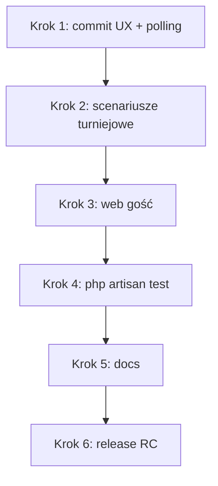

# Plan domknięcia MVP twentySix (v1)

Źródło prawdy: [`product.md`](product.md) — sekcja „Kryterium MVP jest gotowe”.  
Stan quick game: krok **4E** ✅ (scenariusze manualne A–F przeszły).

Ostatnia aktualizacja planu: czerwiec 2026.

---

## Podsumowanie stanu

| Obszar | Status |
|--------|--------|
| Quick game FFA 2–8 (`one_device` + `each_own`) | ✅ |
| Trening mobile (bez zapisu) | ✅ |
| Presence FFA, walkower, powrót do meczu | ✅ (poza 4E — dopisać do scenariuszy) |
| Turniej tablet + web | ✅ w kodzie — **wymaga scenariuszy manualnych** |
| MySQL (dev) | ✅ |
| Release / deploy prod | ❌ |

---

## Kolejność prac

### Krok 1 — Domknięcie zmian z sesji dev ✅ (dzień 1)

- [x] Fix pollingu `GET .../ffa/state` (`useGameScoring` — stabilny `loadState`)
- [x] UX liczników: overlay „Czekaj na swoją kolejkę” / „Mecz został zakończony”
- [x] Log Reverb: poprawny `authEndpoint` w debugu
- [ ] Commit + push mobile (ten krok)

### Krok 2 — Scenariusze turniejowe (manualne)

Patrz też: [`../twentysix-mobile/IMPLEMENTED_FEATURES.md`](../twentysix-mobile/IMPLEMENTED_FEATURES.md).

1. **Faza grupowa:** tablet → mecz BO3 → wynik w tabeli na webie.
2. **Playoff:** mecz pucharowy → awans w drabince na webie.
3. **Live + achievementy:** podgląd live meczu na webie; achievement po meczu (tablet / API).
4. **Korekta / walkower:** admin na webie (np. 2:0) → auto przeliczenie tabeli i playoff.

**Kryterium done:** wszystkie 4 punkty przechodzą bez regresji na MySQL.

### Krok 3 — Web gość (weryfikacja)

- [ ] Podgląd lig i turniejów **bez logowania**
- [ ] Live pojedynczego meczu (`/games/{type}/{id}/live`)
- [ ] Start turnieju + zaproszenia (web wysyłka, mobile akceptacja — regresja)

**Kryterium done:** gość może przeglądać publiczne dane; zalogowany organizator może skorygować wynik.

### Krok 4 — Testy automatyczne + CI

```bash
cd twentysix-backend
php artisan test
```

- [ ] Baza testowa `dartscore_test` (MySQL) skonfigurowana lokalnie i w CI
- [ ] Wszystkie testy Feature/Unit zielone
- [ ] Naprawa ewentualnych faili po MySQL

### Krok 5 — Dokumentacja zamykająca

- [ ] Aktualizacja [`IMPLEMENTED_FEATURES.md`](../IMPLEMENTED_FEATURES.md) (backend)
- [ ] Aktualizacja [`../twentysix-mobile/IMPLEMENTED_FEATURES.md`](../twentysix-mobile/IMPLEMENTED_FEATURES.md)
- [ ] Rozszerzenie [`scenariusze_manualne_quick_game_mvp_4e.md`](scenariusze_manualne_quick_game_mvp_4e.md) o presence / walkower / powrót do meczu
- [ ] Opcjonalnie: osobny plik scenariuszy turniejowych (jak 4E)
- [ ] README deploy: MySQL, `migrate --seed`, `reverb:start`, `serve --host=0.0.0.0`, IP w mobile `apiConfig.js`

### Krok 6 — Release candidate (MVP v1)

- [ ] Hosting backendu + Reverb (prod/staging)
- [ ] HTTPS / WSS jeśli poza LAN
- [ ] Build mobile (Expo) wskazujący na prod API
- [ ] Seed demo (`gracz1@test.pl` …) lub instrukcja dla testerów
- [ ] Tag `v1.0.0-mvp` po akceptacji testerów

---

## Świadomie poza MVP (nie blokuje v1)

Patrz [`product.md`](product.md) — sekcja „Poza MVP”:

- Krykiet w lobby
- Znajomi na webie
- Konfigurowalna liczba legów (BO5+)
- Live całego turnieju (WS) — MVP wymaga live **meczu**, nie całego eventu
- Push do zaproszeń
- Import danych ze starego SQLite

---

## Diagram zależności



---

## Powiązane pliki

| Obszar | Dokument / kod |
|--------|----------------|
| Quick game plan (zamknięty) | [`plan_quick_game_mvp_step4.md`](plan_quick_game_mvp_step4.md) |
| Scenariusze quick game | [`scenariusze_manualne_quick_game_mvp_4e.md`](scenariusze_manualne_quick_game_mvp_4e.md) |
| Produkt | [`product.md`](product.md) |
| Mobile mapa | [`../twentysix-mobile/IMPLEMENTED_FEATURES.md`](../twentysix-mobile/IMPLEMENTED_FEATURES.md) |
