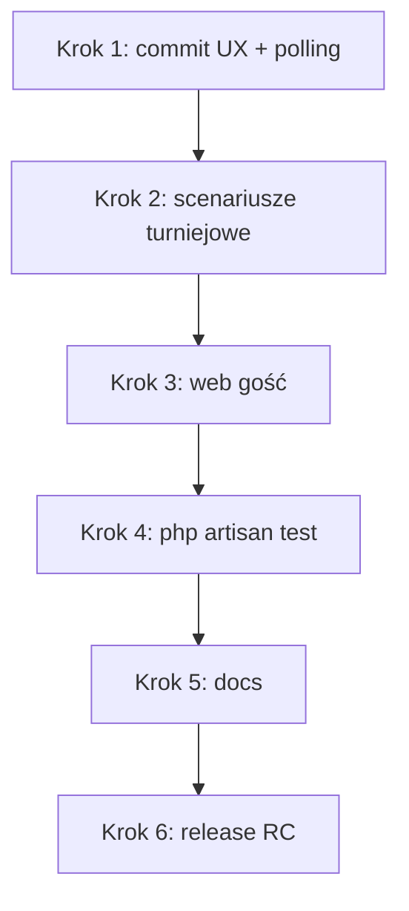

# Plan domknięcia MVP twentySix (v1)

Źródło prawdy: [`product.md`](product.md) — sekcja „Kryterium MVP jest gotowe”.  
Stan quick game: krok **4E** ✅ (scenariusze manualne A–F przeszły).

Ostatnia aktualizacja planu: lipiec 2026.

---

## Podsumowanie stanu

| Obszar | Status |
|--------|--------|
| Quick game FFA 2–8 (`one_device` + `each_own`) | ✅ |
| Trening mobile (bez zapisu) | ✅ |
| Presence FFA, walkower, powrót do meczu | ✅ |
| Turniej tablet + web | ✅ (scenariusze manualne krok 2) |
| Web gość + znajomi web | ✅ (krok 3) |
| Testy auto (`php artisan test`) | ✅ (krok 4 — 172 passed, 14 skipped) |
| Dokumentacja zamykająca | ✅ (krok 5) |
| MySQL (dev) | ✅ |
| Release / deploy prod | ❌ (krok 6) |

---

## Kolejność prac

### Krok 1 — Domknięcie zmian z sesji dev ✅ (dzień 1)

- [x] Fix pollingu `GET .../ffa/state` (`useGameScoring` — stabilny `loadState`)
- [x] UX liczników: overlay „Czekaj na swoją kolejkę” / „Mecz został zakończony”
- [x] Log Reverb: poprawny `authEndpoint` w debugu
- [x] Commit + push mobile (ten krok)

### Krok 2 — Scenariusze turniejowe (manualne) ✅

Szczegóły: [`scenariusze_manualne_turniej_mvp.md`](scenariusze_manualne_turniej_mvp.md).

Patrz też: [`../twentysix-mobile/IMPLEMENTED_FEATURES.md`](../twentysix-mobile/IMPLEMENTED_FEATURES.md).

1. **Faza grupowa:** tablet → mecz BO3 → wynik w tabeli na webie.
2. **Playoff:** mecz pucharowy → awans w drabince na webie.
3. **Live + achievementy:** podgląd live meczu na webie; achievement po meczu (tablet / API).
4. **Korekta / walkower:** admin na webie (np. 2:0) → auto przeliczenie tabeli i playoff.

**Kryterium done:** wszystkie 4 punkty przechodzą bez regresji na MySQL.

### Krok 3 — Web gość (weryfikacja) ✅

Szczegóły: [`scenariusze_manualne_web_gosc_krok3.md`](scenariusze_manualne_web_gosc_krok3.md).

- [x] Podgląd lig i turniejów **bez logowania**
- [x] Live pojedynczego meczu (`/games/{type}/{id}/live`)
- [x] Start turnieju + zaproszenia (web wysyłka, mobile akceptacja — regresja)
- [x] Znajomi web: invite → accept (panel boczny)

**Kryterium done:** gość może przeglądać publiczne dane; zalogowany organizator może skorygować wynik.

### Krok 4 — Testy automatyczne + CI ✅

```bash
cd twentysix-backend
php artisan test
```

- [x] Baza testowa `dartscore_test` (MySQL) skonfigurowana lokalnie
- [x] Wszystkie testy Feature/Unit zielone (172 passed, 14 skipped)
- [x] Naprawa faili turniejowych (pula uczestników, min. 3/grupa)

### Krok 5 — Dokumentacja zamykająca ✅

- [x] Aktualizacja [`IMPLEMENTED_FEATURES.md`](../IMPLEMENTED_FEATURES.md) (backend)
- [x] Aktualizacja [`../twentysix-mobile/IMPLEMENTED_FEATURES.md`](../twentysix-mobile/IMPLEMENTED_FEATURES.md)
- [x] Rozszerzenie [`scenariusze_manualne_quick_game_mvp_4e.md`](scenariusze_manualne_quick_game_mvp_4e.md) o presence / walkower / powrót do meczu (G–I)
- [x] Scenariusze turniejowe: [`scenariusze_manualne_turniej_mvp.md`](scenariusze_manualne_turniej_mvp.md)
- [x] README deploy: [`README.md`](../README.md) — MySQL, `migrate --seed`, `reverb:start`, `serve --host=0.0.0.0`, IP w mobile `apiConfig.js`

### Krok 6 — Release candidate (MVP v1)

Szczegółowy plan operacyjny: [`plan_krok6_release_rc.md`](plan_krok6_release_rc.md).

| Podkrok | Opis | Status |
|---------|------|--------|
| 6.0 | Commity + testy przed deploy | ✅ |
| 6.1 | `.env.staging.example` + [`deploy_staging.md`](deploy_staging.md) | ✅ |
| 6.2 | Hosting backend + Reverb (staging) | ⬜ |
| 6.3 | HTTPS / WSS + SMTP | ⬜ |
| 6.4 | Mobile build (`EXPO_PUBLIC_*`, EAS) — częściowo (config ✅, build ⬜) | 🔄 |
| 6.5 | [`instrukcja_testerow_mvp_v1.md`](instrukcja_testerow_mvp_v1.md) | ✅ |
| 6.6 | Tag `v1.0.0-mvp` po akceptacji | ⬜ |

---

## Świadomie poza MVP (nie blokuje v1)

Patrz [`product.md`](product.md) — sekcja „Poza MVP”:

- Krykiet w lobby
- Konfigurowalna liczba legów (BO5+)
- Live całego turnieju (WS) — MVP wymaga live **meczu**, nie całego eventu
- Push do zaproszeń
- Import danych ze starego SQLite

> **Zrealizowane poza pierwotnym scope MVP:** znajomi na webie (invite → accept, panel boczny) — lipiec 2026.

---

## Diagram zależności



---

## Powiązane pliki

| Obszar | Dokument / kod |
|--------|----------------|
| Quick game plan (zamknięty) | [`plan_quick_game_mvp_step4.md`](plan_quick_game_mvp_step4.md) |
| Scenariusze quick game | [`scenariusze_manualne_quick_game_mvp_4e.md`](scenariusze_manualne_quick_game_mvp_4e.md) |
| Produkt | [`product.md`](product.md) |
| Release RC (krok 6) | [`plan_krok6_release_rc.md`](plan_krok6_release_rc.md) |
| Mobile mapa | [`../twentysix-mobile/IMPLEMENTED_FEATURES.md`](../twentysix-mobile/IMPLEMENTED_FEATURES.md) |
