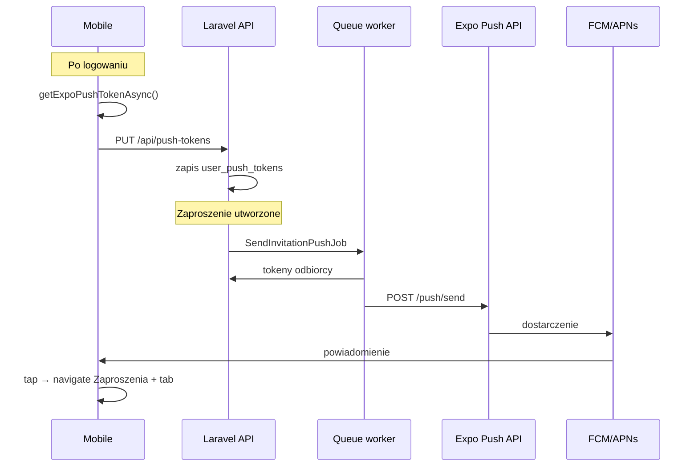

# Plan: powiadomienia push — zaproszenia (mobile)

**Status:** ✅ **wdrożone** (kod lipiec 2026) — E2E na fizycznym APK wymaga FCM w Expo dashboard (właściciel)  
**Ostatnia aktualizacja planu:** lipiec 2026  
**Źródło prawdy produktu:** [`product.md`](product.md) — sekcje „Zaproszenia do turnieju”, „Znajomi”, „Quick game”  
**Powiązany ekran mobile:** `InvitationsScreen.jsx` (zakładki: Turniej | Pojedynek | Znajomi)

---

## 1. Cel i zakres

### 1.1 Co robimy

Powiadomienia **push na mobile**, gdy zalogowany użytkownik **otrzymuje nowe zaproszenie**:

| Typ | Kto wysyła | Odbiorca push |
|-----|------------|---------------|
| **Znajomi** | Inny użytkownik (mobile API lub web) | `receiver_id` |
| **Turniej** | Admin/organizator (głównie **web** — strona startu) | `user_id` zaproszonego |
| **Quick game (lobby)** | Host lobby (mobile) | `user_id` gracza powiązanego z `player_id` |

Tapnięcie powiadomienia → ekran **`Zaproszenia`** (`Screens.jsx`, route `Zaproszenia`) z **właściwą zakładką**.

### 1.2 Czego nie robimy w pierwszej iteracji

- Push na **web** (przeglądarka).
- Push o innych zdarzeniach (koniec meczu, awans w turnieju, wiadomości czatu).
- Push gdy użytkownik **sam** wysłał zaproszenie (tylko odbiorca).
- Push po **anulowaniu** / **odrzuceniu** zaproszenia (opcjonalnie później).
- Rich media, obrazki, akcje inline (Accept/Reject z paska powiadomień) — na później.
- Własny serwer FCM — używamy **Expo Push API** (prostsze przy EAS).

### 1.3 Fallback (bez zmian)

Brak tokena push lub odrzucone uprawnienia → użytkownik nadal korzysta z **pull-to-refresh** na ekranie Zaproszenia (MVP v1).

---

## 2. Stan kodu dziś (punkt startowy)

| Warstwa | Stan |
|---------|------|
| **Mobile** | Brak `expo-notifications`; brak rejestracji tokena |
| **Backend** | Brak tabeli tokenów; brak wysyłki push; Laravel Notifications tylko dla **email** (`VerifyEmailNotification`) |
| **Zaproszenia API** | ✅ Znajomi `/api/friends/*`, turniej `/api/tournaments/invitations/*`, lobby `/api/quick-game/lobby/invitations` |
| **Reverb** | Sync lobby/meczu **w aplikacji** — **nie zastępuje** push gdy app zamknięta |

### 2.1 Hooki backend — gdzie wysłać push (po utworzeniu zaproszenia)

| Typ | Plik / metoda | Uwagi |
|-----|---------------|--------|
| Znajomi | `FriendshipService::sendInvitation` | Wywoływane z `FriendshipController` (mobile) i `PlayerController` (web) |
| Turniej (pojedyncze) | `TournamentInvitationService::send` | Web — strona startu turnieju |
| Turniej (masowe) | `TournamentInvitationService::sendBulk` | W pętli — **kolejka** zamiast synchronicznego HTTP × N |
| Quick game | `QuickGameLobbyService::invite` | Po `createInvitation`; odbiorca = `Player.user_id` |

---

## 3. Decyzja technologiczna

### 3.1 Stack (rekomendowany)

```
Mobile: expo-notifications + expo-device
        → Expo Push Token (ExponentPushToken[...])
        → POST /api/push-tokens (backend)

Backend: Laravel HTTP → https://exp.host/--/api/v2/push/send
         (opcjonalnie: laravel-notification-channels/expo — nie wymagane na start)

Dostarczenie: Expo → FCM (Android) / APNs (iOS)
```

**Dlaczego Expo Push:** projekt już na EAS (`app.json` → `extra.eas.projectId`), build preview/production — naturalne dopasowanie.

### 3.2 Alternatywa (odłożona)

Bezpośrednie FCM z Laravel — więcej konfiguracji po stronie mobile (`google-services.json`, własny handler). Nie rekomendowane na pierwszy release push.

---

## 4. Architektura



---

## 5. Backend — szczegóły implementacji

### 5.1 Migracja: `user_push_tokens`

```sql
user_push_tokens
  id
  user_id          FK users, ON DELETE CASCADE
  expo_push_token  string, unique
  platform         enum: android | ios | unknown
  device_name      string nullable (opcjonalnie, z mobile)
  last_seen_at     timestamp
  created_at, updated_at

INDEX (user_id)
UNIQUE (expo_push_token)
```

Jeden użytkownik może mieć **wiele urządzeń** (telefon + tablet).

### 5.2 API (Sanctum, zalogowany użytkownik)

| Metoda | Endpoint | Body | Opis |
|--------|----------|------|------|
| `PUT` | `/api/push-tokens` | `{ "token": "ExponentPushToken[...]", "platform": "android" }` | Upsert po tokenie; przypisz do `auth()->id()` |
| `DELETE` | `/api/push-tokens` | `{ "token": "..." }` | Przy wylogowaniu lub revoke uprawnień |

Walidacja: token musi pasować do wzorca Expo (`ExponentPushToken[...]`).

### 5.3 Serwisy (propozycja plików)

| Plik | Odpowiedzialność |
|------|------------------|
| `app/Repositories/Push/UserPushTokenRepository.php` | CRUD tokenów, `getTokensForUser(int $userId)` |
| `app/Services/Push/ExpoPushService.php` | HTTP do Expo API, batch do 100 tokenów, obsługa błędów |
| `app/Services/Push/InvitationPushService.php` | Składanie tytułu/treści + `data` payload per typ zaproszenia |
| `app/Jobs/SendInvitationPushJob.php` | Async wysyłka (queue) |

**Konfiguracja:** opcjonalnie `EXPO_ACCESS_TOKEN` w `.env` (Expo push security) — zalecane na prod; bez niego też działa z ograniczeniami rate.

### 5.4 Payload powiadomienia (kontrakt mobile ↔ backend)

Wspólne pole `data` (Expo `data` → odczyt w `expo-notifications`):

```json
{
  "type": "friend_invitation | tournament_invitation | lobby_invitation",
  "invitationId": "123",
  "screen": "Zaproszenia",
  "tab": "friends | tournament | pojedynek"
}
```

Przykłady treści (PL):

| type | title | body (przykład) |
|------|-------|----------------|
| `friend_invitation` | twentySix | `{senderName} zaprasza Cię do znajomych` |
| `tournament_invitation` | twentySix | `Zaproszenie do turnieju: {tournamentName}` |
| `lobby_invitation` | twentySix | `{hostName} zaprasza Cię do quick game` |

### 5.5 Integracja w serwisach zaproszeń

Po **udanym** utworzeniu rekordu zaproszenia (w tej samej transakcji lub tuż po commit):

```php
SendInvitationPushJob::dispatch(
    recipientUserId: ...,
    type: InvitationPushType::Tournament,
    invitationId: ...,
    context: [...], // nazwy do body
);
```

**Turniej bulk:** jeden job z listą `userIds` albo N jobów — preferuj **batch Expo** w jednym jobie.

**Nie wysyłaj push gdy:**

- brak tokenów u odbiorcy (cicho skip),
- zaproszenie nie jest w statusie `pending` (reinvite — produktowo zdecyduj: push przy ponownym invite **tak**).

### 5.6 Czyszczenie martwych tokenów

Expo zwraca `details.error: DeviceNotRegistered` → usuń token z DB.

### 5.7 Testy backend (PHPUnit)

| Test | Opis |
|------|------|
| `PushTokenApiTest` | PUT upsert, DELETE, auth required |
| `ExpoPushServiceTest` | Mock HTTP — poprawny JSON do Expo |
| `FriendshipPushTest` | `sendInvitation` dispatchuje job (fake Queue) |
| `TournamentInvitationPushTest` | `send` / `sendBulk` dispatch |
| `QuickGameLobbyPushTest` | `invite` dispatch |

---

## 6. Mobile — szczegóły implementacji

### 6.1 Zależności

```bash
npx expo install expo-notifications expo-device expo-constants
```

### 6.2 `app.json` / plugin

```json
"plugins": [
  "expo-notifications",
  ...
]
```

Android: kanał powiadomień `invitations` (Android 8+).  
iOS: prośba o uprawnienia przy pierwszym logowaniu (lub delikatny prompt na ekranie Zaproszeń).

### 6.3 Proponowane pliki

| Plik | Rola |
|------|------|
| `helpers/pushNotifications/registerPushToken.js` | Uprawnienia + `getExpoPushTokenAsync` + PUT API |
| `helpers/pushNotifications/unregisterPushToken.js` | DELETE przy logout |
| `hooks/usePushNotifications.js` | Listener: `addNotificationResponseReceivedListener` → nawigacja |
| Integracja w `AuthProvider` / po loginie | Rejestracja tokena |
| Integracja w logout | Usunięcie tokena |

**Wymaga fizycznego urządzenia** (`Device.isDevice`) — emulator/simulator nie dostanie prawdziwego pusha.

### 6.4 Nawigacja po tapnięciu

Route stack (zalogowany user): `name="Zaproszenia"` w `pages/Screens.jsx`.

`InvitationsScreen` — dodać obsługę parametru początkowego:

```js
// route.params?.tab → 'friends' | 'tournament' | 'pojedynek'
// mapowanie z data.tab z push
```

Stałe zakładek (już w kodzie): `TAB_TOURNAMENT`, `TAB_POJEDYNEK`, `TAB_FRIENDS`.

### 6.5 Foreground vs background

- **Background / killed:** standardowy push systemowy.
- **Foreground:** opcjonalnie `setNotificationHandler` — można pokazać banner in-app lub polegać na systemowym (prostsze: systemowy).

Po tapnięciu w każdym przypadku: nawigacja + `fetchAll()` na `InvitationsScreen`.

### 6.6 `helpers/apiConfig.js`

Dodać:

```js
export const PUSH_TOKENS_API_URL = API_BASE_URL + '/push-tokens';
```

---

## 7. Konfiguracja EAS / FCM / APNs (właściciel projektu)

Wykonane **przy pierwszym teście na prawdziwym APK** — agent implementuje kod, **nie** robi builda bez prośby.

### 7.1 Android

1. Firebase project → włączyć Cloud Messaging.
2. W Expo dashboard (projekt `ad6699cc-fcd5-4f14-820b-a90f4f7899ea`): Upload **FCM V1 service account key** (lub legacy server key — sprawdzić aktualną dokumentację Expo SDK 54).
3. `eas build --profile preview` → instalacja APK na telefonie.

### 7.2 iOS (gdy potrzebne)

1. Apple Developer — App ID z Push Notifications capability.
2. EAS zarządza certyfikatem push przy buildzie.
3. Test na fizycznym iPhone.

### 7.3 Expo Go

Ograniczone wsparcie push w dev — **ostateczna weryfikacja na buildzie EAS**, nie tylko Expo Go.

---

## 8. Fazy realizacji (kolejność PR)

### Faza A — Fundament (backend + mobile token)

- [x] Migracja `user_push_tokens`
- [x] `PushTokenController` + routes
- [x] Mobile: rejestracja tokena po logowaniu, DELETE przy logout
- [x] Testy API tokenów

**Kryterium done:** token w DB po logowaniu na dev build; brak wysyłki push jeszcze OK.

### Faza B — Znajomi (najprostszy flow)

- [x] `ExpoPushService` + `InvitationPushService`
- [x] Job + hook w `FriendshipService::sendInvitation`
- [x] Mobile: listener tap → `Zaproszenia` tab `friends`
- [x] Test Feature + ręczny test 2 telefonów

**Kryterium done:** invite znajomego → push na drugim telefonie → tap → ekran zaproszeń.

### Faza C — Quick game lobby

- [x] Hook w `QuickGameLobbyService::invite`
- [x] Nawigacja tab `pojedynek`
- [x] Test

### Faza D — Turniej (web → mobile)

- [x] Hook w `TournamentInvitationService::send` i `sendBulk`
- [x] Kolejka dla bulk
- [x] Nawigacja tab `tournament`
- [x] Test: admin wysyła z web → gracz dostaje push na mobile

### Faza E — Polish (opcjonalnie później)

- [ ] Badge count (liczba pending) — wymaga `expo-notifications` setBadgeCount
- [ ] Ustawienia w app: „Powiadomienia o zaproszeniach” on/off
- [x] Logowanie błędów Expo w Laravel (`Log::warning`)
- [x] Aktualizacja `IMPLEMENTED_FEATURES.md` + `product.md`

---

## 9. Szacunek nakładu

| Faza | Dev (orientacyjnie) |
|------|---------------------|
| A | 0,5–1 dzień |
| B | 1 dzień |
| C | 0,5 dnia |
| D | 1 dzień (+ bulk/queue) |
| E | 1–2 dni |
| **Konfiguracja EAS/FCM (Ty)** | 2–4 h pierwszy raz |

**Razem kod:** ~3–5 dni. **Pierwszy end-to-end push:** wymaga builda APK od właściciela projektu.

---

## 10. Checklist testów manualnych (po wdrożeniu)

- [ ] Android: pierwsze uruchomienie → system prosi o powiadomienia → Akceptuj
- [ ] Znajomi: A zaprasza B → B dostaje push (app w tle)
- [ ] Tap push → `Zaproszenia` / Znajomi, zaproszenie widoczne
- [ ] Turniej: web wysyła invite → mobile push
- [ ] Quick game: host invite → push u gościa
- [ ] Wylogowanie → token usunięty (brak push po logout)
- [ ] Drugie urządzenie tego samego usera → push na oba (jeśli zarejestrowane)
- [ ] Brak uprawnień → app działa, pull-to-refresh OK
- [ ] Bulk invite 10+ graczy → queue przetwarza, brak timeoutu HTTP web

---

## 11. Otwarte decyzje (do ustalenia przed kodem)

| # | Pytanie | Propozycja domyślna |
|---|---------|---------------------|
| 1 | Push przy **ponownym** zaproszeniu turniejowym (reinvite)? | **Tak** |
| 2 | Kiedy prosić o uprawnienia? | Po **pierwszym udanym logowaniu** (nie przy starcie app gościa) |
| 3 | Tytuł powiadomienia | Zawsze **twentySix** (marka) |
| 4 | `EXPO_ACCESS_TOKEN` na prod | **Tak** — Expo dashboard |
| 5 | iOS w pierwszej iteracji? | Tylko Android jeśli szybciej; architektura ta sama |

---

## 12. Po wdrożeniu — aktualizacja docs

- [ ] `product.md` — zmienić „Push — docelowo” na ✅ z linkiem do tego pliku (sekcja archiwum planu)
- [ ] `IMPLEMENTED_FEATURES.md` (backend + mobile)
- [ ] `docs/README.md` — status planu → zaimplementowane
- [ ] Usunąć „push do zaproszeń” z „poza scope” w `NEXT_STEPS.md`

---

## 13. Powiązane pliki (quick reference)

**Backend**

- `app/Services/Friends/FriendshipService.php`
- `app/Services/Tournament/TournamentInvitationService.php`
- `app/Services/QuickGame/QuickGameLobbyService.php`
- `routes/api.php`
- `app/Models/Users/User.php`

**Mobile**

- `components/Invitations/InvitationsScreen.jsx`
- `pages/Screens.jsx` (route `Zaproszenia`)
- `context/AuthProvider.jsx` (login/logout)
- `app.json`, `eas.json`

**Dokumentacja**

- [`product.md`](product.md)
- [`deploy_staging.md`](deploy_staging.md) — queue worker musi działać dla jobów push

---

*Aby rozpocząć implementację: agent czyta ten plik od **§8 Fazy realizacji**, zaczyna od **Fazy A**, nie pomija testów PHPUnit dla backendu.*
