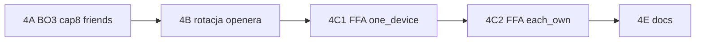

# Plan: Quick game MVP (krok 4)

Źródło prawdy: [`product.md`](product.md) — sekcje „Quick game (MVP)” i „Quick game — tryb urządzeń”.

**Cel:** Doprowadzić quick game do wymagań MVP: BO3 = 2 legi, FFA do 8 graczy, rotacja openera lega, tylko znajomi, multi-device (kolejka tur) dla 3+.

**Stan po kroku 3 (turniej):** Scoring API + WS działa dla **2P online** (`createLiveQuickGameIfEligible` tworzy `quick_games` tylko przy dokładnie 2 zarejestrowanych graczach). Lobby cap **6**, domyślnie `legsCount=3`, brak walidacji friends-only, FFA 3+ tylko lokalnie bez live sync.

---

## Luki vs product.md

| Wymaganie MVP | Stan | Główna luka |
|---------------|------|-------------|
| BO3 = pierwszy do **2** legów | ⚠️ `legsCount=3` w lobby/API | Semantyka: `legsCount` vs `legsToWin` |
| Max **8** graczy | ⚠️ cap 6 (API + UI) | `QuickGameLobbyService::addGuest`, mobile lobby |
| Tylko **znajomi** | ❌ | `invite()` bez `FriendshipRepository`; `add-guest` bez blokady |
| FFA 3+ online | ❌ | Brak `quick_games` / scoring dla N>2 |
| Rotacja openera lega | ❌ | Po wygranej: `(winnerIdx+1)` zamiast opener+1 |
| Multi-device 3+ | ❌ | `each_own` tylko sensowne dla 2P ze scoring API |
| Wyniki w statystykach | ⚠️ | `finishFromMobile` / `quick_game_results` — sprawdzić FFA |

---

## Semantyka BO3 (decyzja na start)

**Rekomendacja:** W całym stacku rozróżnić:

- `legsToWin = 2` — BO3 (product)
- `legsCount` w lobby/API = **legs to win**, nie „liczba legów w meczu”

Zmiany: domyślna wartość lobby **2**, etykieta UI „Pierwszy do 2 legów”, backend `QuickGame::legs_count` / `GameScoringContext::legsToWin` spójnie.

---

## Etap 4A — BO3 + cap 8 + friends-only (niski ryzyko, osobny PR)

**Backend**

1. Domyślne `legs_count = 2` (migracja default na `quick_game_lobbies` / `quick_games` jeśli potrzeba).
2. Cap lobby **8** — `addGuest`, ewentualnie `join` po akceptacji zaproszenia.
3. **Friends-only:**
   - `QuickGameLobbyService::invite` — sprawdzenie `FriendshipRepository::areFriends(hostUserId, invitedUserId)`.
   - Opcjonalnie: odrzucić `add-guest` w MVP (product: tylko znajomi) **lub** zostawić gości tylko offline — **rekomendacja: wyłączyć add-guest w API** (400 + komunikat).
4. Testy feature: invite nie-znajomego → 400; cap 9. gracza → 400; start z `legsCount=2`.

**Mobile**

1. Lobby: domyślnie `legsCount=2`, picker bez „3” jako default (BO3 fixed w MVP).
2. Cap UI **8**; ukryć/wyłączyć dodawanie gościa jeśli API blokuje.
3. Lista zaproszeń w lobby — tylko znajomi (już częściowo); obsłużyć błąd API „nie jesteś znajomym”.

**Kryterium:** Lobby 2P znajomych, BO3, start bez regresji obecnego scoring 2P.

---

## Etap 4B — Rotacja openera lega (mobile, średnie ryzyko)

**Dotyczy:** offline FFA i online (gdy N≥2 graczy).

1. W `GameScoringScreen` (ścieżka bez scoring API lub wspólna logika):
   - Trzymać `legOpenerIndexRef` — kto zaczął **bieżący** leg.
   - Po `legWin` / zamknięciu lega przez API: `nextOpener = (legOpenerIndex + 1) % N` (**nie** winner+1).
   - Kolejność tur w legu: opener → opener+1 → … cyklicznie.
2. Przy starcie meczu: opener = indeks 0 w `playerOrder` z lobby.
3. Bull modal / wybór pierwszego rzucającego — tylko **leg 1** (jak dziś turniej pomija online).

**Testy:** unit/helper `computeNextLegOpener(opener, N)` + scenariusz manualny 4 graczy, 3 legi — openery A,B,C.

---

## Etap 4C — FFA 3–8 online (backend, wysokie ryzyko)

Dziś scoring API jest **H2H** (`player1_id`, `player2_id`, 2 sloty w `GameScoringStateBuilder`).

**Opcje:**

| Opcja | Opis | Plusy / minusy |
|-------|------|----------------|
| **A. Multi quick game (N modeli)** | N graczy FFA = osobny tryb bez wspólnego `quick_games` H2H; wynik tylko `quick_game_results` + lobby meta | Mniej refactoru scoring visits |
| **B. Rozszerzyć scoring API** | `quick_games` N graczy, legi z wieloma `player_id` w wizytach | Spójne z 2P, duży refactor |

**Rekomendacja MVP:** **Opcja A na pierwszy PR FFA online:**

1. `createLiveQuickGameIfEligible` → `createLiveQuickGameForLobby`:
   - 2 zarejestrowanych → obecny flow (scoring API).
   - 3–8 zarejestrowanych → utwórz rekord „sesji” (np. `quick_games` z flagą FFA / tabela `quick_game_sessions`) **bez** H2H scoring; synchronizacja przez **lobby WS** + wspólny stan w Redis/DB **lub** prosty endpoint `POST quick-game/lobby/{id}/state` (minimalny MVP).
2. Alternatywa prostsza: **FFA 3+ tylko `one_device`** w pierwszej iteracji (jeden tablet wpisuje wszystkich) — scoring lokalny + jeden POST `finishFromMobile` z `players[]` — **mniej wartości niż multi-device**, ale mniejszy koszt.

**Rekomendacja produktowa (z product.md):** multi-device wymagane — planuj **4C w dwóch pod-etapach:**

- **4C1:** FFA 3–8, `one_device`, wynik + statystyki w DB (bez live sync między telefonami).
- **4C2:** FFA 3–8, `each_own`, wspólny stan meczu (nowy kontrakt API/WS — osobny design doc przed kodem).

---

## Etap 4D — Multi-device FFA (`each_own`, 3+) (największy, osobny PR)

**Wymagania product:**

- Ten sam widok na każdym telefonie.
- Gracz wpisuje tylko w swojej turze.
- Kolejka tur + rotacja openera zsynchronizowana.

**Propozycja kontraktu (szkic):**

```
POST /api/quick-game/lobby/{lobbyId}/ffa/visits   — wizyta gracza
GET  /api/quick-game/lobby/{lobbyId}/ffa/state    — pełny stan
WS   quick-game-lobby.{lobbyId}                   — event ffa.state
```

Stan: `{ players[], currentLeg, visits[], legOpenerIndex, currentPlayerIndex, legsWon[], status }`.

**Mobile:** nowy hook `useQuickGameFfaScoring` lub rozszerzenie `useGameScoring` o `channelKind: 'ffa'`.

**Regresja:** 2P `each_own` nadal przez istniejący `quick-games/{id}/scoring/*`.

---

## Etap 4E — Dokumentacja + testy (krótki PR)

- Aktualizacja `IMPLEMENTED_FEATURES.md` (backend + mobile).
- Testy feature: friends-only invite, BO3 finalize, (po 4C) FFA wynik w `quick_game_results`.
- Scenariusze manualne (po MVP release): 2P each_own, 4P one_device, rotacja A→B→C→D.

---

## Kolejność PR (rekomendowana)



| Etap | Szacunek | Ryzyko |
|------|----------|--------|
| 4A | 0.5–1 d | Niskie |
| 4B | 0.5–1 d | Średnie (GameScoringScreen) |
| 4C1 | 1–2 d | Średnie |
| 4C2 | 2–4 d | Wysokie |
| 4E | 0.5 d | — |

**Start:** Etap **4A** — szybkie dopasowanie do product.md bez dotykania architektury scoringu.

---

## Świadomie poza krokiem 4

- Krykiet w lobby (poza MVP).
- Offline / solo ćwiczenia (krok 5 w priorytetach).
- Zaproszenia znajomych UI (osobny punkt priorytetów mobile, nie quick game).
- Konfigurowalna liczba legów > BO3 (docelowo).

---

## Powiązane pliki

| Obszar | Pliki |
|--------|--------|
| Lobby backend | `QuickGameLobbyService.php`, `QuickGameLobbyController.php` |
| Live 2P | `createLiveQuickGameIfEligible`, `QuickGameScoringService` |
| Lobby mobile | `QuickGameLobby.jsx` |
| Mecz | `GameScoringScreen.jsx`, `useGameScoring.js` |
| Wynik | `QuickGameService::finishFromMobile`, `QuickGameRepository::saveResults` |
| Znajomi | `FriendshipRepository`, `POST /api/friends/invite` |
