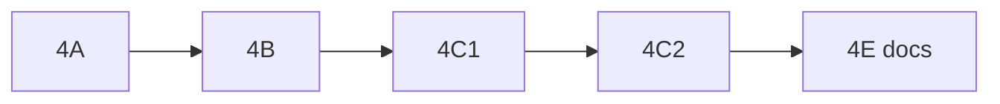

# Plan: Quick game MVP (krok 4)

Źródło prawdy: [`product.md`](product.md).

**Stan (czerwiec 2026):** kroki **4A–4C2** i **4E** (docs) — zrobione. Trening mobile = osobny flow (nie był w pierwotnym planie jako 4D).

> **Uwaga o numeracji:** W planie nie ma osobnego **kroku 4D**. Podetapy to **4C1** i **4C2**; na diagramie węzeł „D” oznacza **4E** (dokumentacja), nie 4D.

---

## Podsumowanie etapów

| Etap | Opis | Status |
|------|------|--------|
| **4A** | BO3, cap 8, friends-only, invite-only | ✅ |
| **4B** | Rotacja openera lega (mobile) | ✅ |
| **4C1** | FFA online `one_device` (przez unified FFA) | ✅ |
| **4C2** | FFA sync API/WS N=2..8 (unified) | ✅ |
| **4E** | Dokumentacja, testy, scenariusze manualne | ✅ |
| **Trening** | Mobile offline/local, bez backendu | ✅ (product + `TrainingMatchSetup`) |

---

## Etap 4E — Dokumentacja + testy

- [x] `IMPLEMENTED_FEATURES.md` (backend + mobile)
- [x] Testy: `QuickGameLobbyMvpTest`, `QuickGameFfaScoringApiTest`, achievementy po FFA (`QuickGameApiTest`)
- [x] Scenariusze manualne: [`scenariusze_manualne_quick_game_mvp_4e.md`](scenariusze_manualne_quick_game_mvp_4e.md)
- [x] Usunięto bulk `POST /quick-game/update` (offline quick) — trening tylko mobile

---

## Kolejność (historyczna)

---

## Powiązane pliki

| Obszar | Pliki |
|--------|--------|
| Lobby | `QuickGameLobbyService.php`, `QuickGameLobby.jsx` |
| FFA online | `QuickGameFfaScoringService.php`, `useQuickGameFfaScoring.js` |
| Trening | `TrainingMatchSetup.jsx`, `GameScoringScreen` (`trainingGame`) |
| Wynik online | FFA `finishMatch` → `quick_game_results`; achievementy → `POST /quick-game/update` |

---

## Poza krokiem 4 (krok 5+)

- Krykiet w lobby
- Zaproszenia znajomych UI (osobny priorytet mobile)
- Konfigurowalna liczba legów > BO3
- ~~Legacy H2H `/quick-games/{id}/scoring/*`~~ wycofane (quick online = FFA z lobby)
