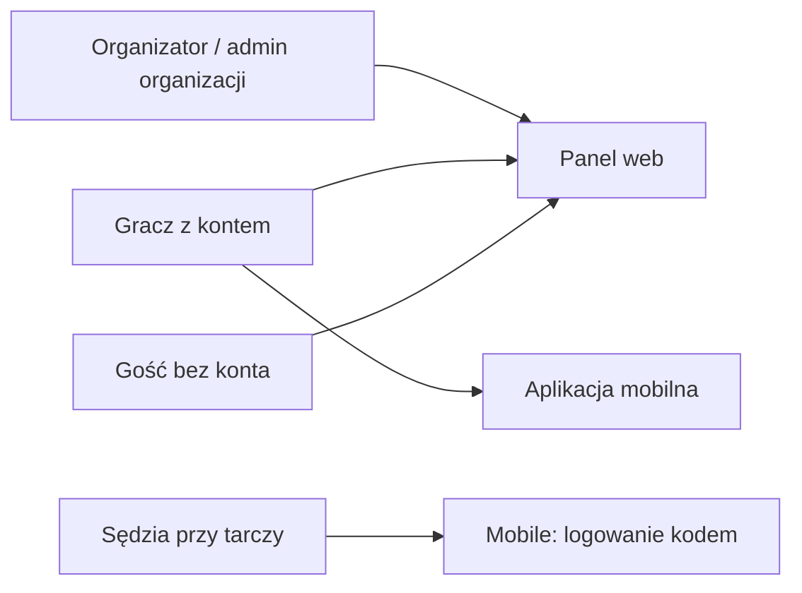

# Przewodnik po twentySix

Krótki opis, **jak działa aplikacja** — od organizacji i turnieju po sędziowanie na tablecie i szybką grę ze znajomymi.

> **Zrzuty ekranu:** wstaw swoje pliki PNG/JPG do folderu [`assets/screenshots/`](assets/screenshots/) pod nazwami wskazanymi przy każdym miejscu. Lista do zrobienia: [`assets/screenshots/README.md`](assets/screenshots/README.md).

---

## Czym jest twentySix?

**twentySix** to system do prowadzenia organizacji i turniejów darterskich oraz meczów ze znajomymi:

| Część | Do czego |
| ----- | -------- |
| **Panel webowy** | Organizacje, sezony, turnieje, zaproszenia, tabele, wyniki na żywo |
| **Aplikacja mobilna** | Sędziowanie turnieju (tablet), szybka gra online, trening, znajomi |
| **Web — sędziowanie** | Ten sam kod tabletu → `/referee` (laptop przy tarczy; suma wizyty) |

Nazwa produktu: **twentySix**. Znak **26** to tylko logo / ikona.

---

## Kto z czego korzysta?

- **Organizator** — tworzy organizację i turnieje, zaprasza graczy, startuje turniej, pokazuje kod QR tabletom.
- **Gracz** — akceptuje zaproszenia, gra w turniejach i szybkich meczach, ma historię i znajomych.
- **Sędzia (tablet / laptop)** — loguje się **kodem / QR turnieju** (bez konta użytkownika) i wpisuje wyniki meczów w aplikacji mobilnej albo w przeglądarce.
- **Gość web** — może oglądać publiczne organizacje i wyniki.

---

## Flow turnieju — od zera do wyniku

To główna ścieżka produktu: **organizacja → turniej → skład → start → tablety → wyniki**.

### 1. Organizacja i sezon (web)

Organizator tworzy **organizację**, a w niej **sezon**. Turnieje należą do sezonu (albo są turniejami jednorazowymi).

<!-- Zrzut: panel web — lista organizacji albo widok sezonu z listą turniejów. -->

### 2. Utworzenie turnieju (web)

W sezonie: **Nowy turniej** → nazwa, data → przejście do strony przygotowania startu.

<!-- Zrzut: formularz tworzenia turnieju albo strona startu tuż po utworzeniu. -->

### 3. Skład uczestników (web)

Na stronie startu turnieju organizator zbiera zawodników:

1. **Zaproszenia** — wyszukanie gracza / masowe zaproszenie ze składu organizacji → gracz akceptuje w aplikacji (lub na webie).
2. **QR zgłoszenia** — zawodnik skanuje QR ze strony startu → wysyła zgłoszenie → admin **Dołącz / Odrzuć**.
3. **Goście** — nazwa wpisana przez admina (bez konta, bez profilu).

Do gry wchodzą tylko **zaakceptowani + goście**. Start jest możliwy nawet gdy nie wszyscy zaproszeni zaakceptowali.

<!-- Zrzut: sekcja „Dołącz przez QR” + lista uczestników / zgłoszeń. -->

<!-- Zrzut: ekran zaproszeń albo „Dołącz do turnieju” po skanie QR. -->

### 4. Start turnieju (web)

Gdy jest **co najmniej 4** zawodników w puli, admin wybiera wariant:

| Wariant | Co się dzieje |
| ------- | ------------- |
| **Grupy + playoff** | Round-robin w grupach → awans → drabinka |
| **Single elimination** | Od razu drabinka (z wolnymi losami do potęgi 2) |
| **Double elimination** | Drabinka wygranych + przegranych |

Ustawia też **format gry** (np. 501, legi / sety) — tablet **nie konfiguruje** formatu; bierze go z meczu.

<!-- Zrzut: wybór formatu turnieju, grup / drabinki, formatów meczów. -->

Po **Start** system generuje mecze oraz **jeden wspólny kod logowania na tablety** (8 znaków) + QR.

### 5. Logowanie tabletu / sędziego web

Na stronie wystartowanego turnieju admin widzi sekcję **Kod logowania na tablety** (kod + QR).  
Wszystkie urządzenia sędziowskie używają **tego samego** kodu.

Skan QR otwiera `/tablet-login/{code}` — stamtąd: **Sędziuj w przeglądarce** albo deep link do aplikacji.

<!-- Zrzut: sekcja „Kod logowania na tablety” z QR i 8-znakowym kodem. -->

Na tablecie / telefonie:

1. Ekran główny → **Turniej**
2. **Skanuj QR** albo wpisz kod
3. Lista meczów do rozegrania

Na laptopie: `/referee/login` (lub CTA z QR) → ten sam kod → lista meczów w przeglądarce.

<!-- Zrzut: ekran „Kod turnieju” ze skanerem albo polem kodu. -->

<!-- Zrzut: lista grup / meczów oczekujących po zalogowaniu. -->

### 6. Sędziowanie meczu (mobile / web)

1. Wybór meczu **oczekującego** → **lock** (mecz „w trakcie”; inne urządzenia go nie wezmą).
2. Wpisywanie rzutów (oba zawodnicy na jednym urządzeniu — H2H). Na webie MVP: **suma wizyty** (bez per-dart).
3. Koniec meczu → wynik leci na serwer → aktualizacja tabeli / drabinki na webie (live).

<!-- Zrzut: GameScoring — wynik, pozostałe punkty, klawiatura. -->

<!-- Zrzut: zakładka Grupy z macierzą wyników po rozegranym meczu. -->

### 7. Playoff i zakończenie

Po fazie grupowej startuje drabinka (albo turniej od razu jest SE/DE).  
Gdy wszystkie mecze playoff są skończone, turniej kończy się, kody tabletów przestają działać, punkty idą do tabeli sezonu (gdy turniej jest w sezonie).

<!-- Zrzut: zakładka Playoff / drabinka. -->

---

## Szybka gra (quick game) — skrót

Mecz **poza turniejem**, ze znajomymi:

1. Mobile: **Szybka gra online** → lobby (zaproszenia — **bez kodu lobby**).
2. Host wybiera tryb urządzeń:
   - **Jedno urządzenie** — jeden telefon wpisuje wszystkich przy tarczy.
   - **Każdy na swoim** — każdy wpisuje tylko swoją turę (sync API + WebSocket).
3. 2–8 graczy, FFA (każdy gra sam), format konfigurowalny (domyślnie 501 / BO3).

<!-- Zrzut: lobby z listą graczy i trybem one_device / each_own. -->

---

## Trening (mobile)

Bez konta i bez zapisu — lokalna rozgrywka „na sucho”. Wynik znika po meczu.

<!-- Zrzut: start treningu / ekran scoringu w trybie treningowym. -->

---

## Podgląd dla kibiców (web)

Gość bez logowania może oglądać publiczne organizacje, turnieje, tabele i wyniki.  
Live wyników działa, gdy mecz jest w trakcie (WebSocket).

<!-- Zrzut: publiczna strona turnieju / organizacji bez panelu admina. -->

---

## Mapa ekranów (orientacyjnie)

| Cel | Web | Mobile |
| --- | --- | ------ |
| Zarządzanie organizacją / turniejem | tak | — |
| Zaproszenia / zgłoszenia QR | tak (admin) | akceptacja / skan |
| Start turnieju + kody tabletów | tak | — |
| Sędziowanie turnieju | `/referee` (kod tabletu) | Turniej → kod/QR |
| Szybka gra | podgląd live (docelowo) | lobby + scoring |
| Trening | — | bez konta |
| Znajomi | podstawowo | pełniej + push |

---

## Co dalej?

- Scenariusze testowe krok po kroku: [`scenariusze_manualne_turniej_mvp.md`](scenariusze_manualne_turniej_mvp.md)
- Wizja produktu (źródło prawdy): [`product.md`](product.md)
- Aplikacja mobilna (repo): [twentySix-MobileApp](https://github.com/Vathh/twentySix-MobileApp)

---

## Checklist zrzutów

Zobacz [`assets/screenshots/README.md`](assets/screenshots/README.md) — lista plików `01`–`14` do dodania.
